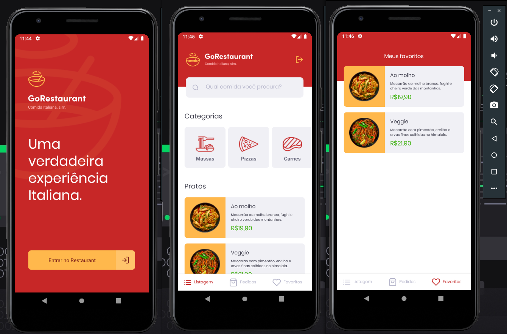
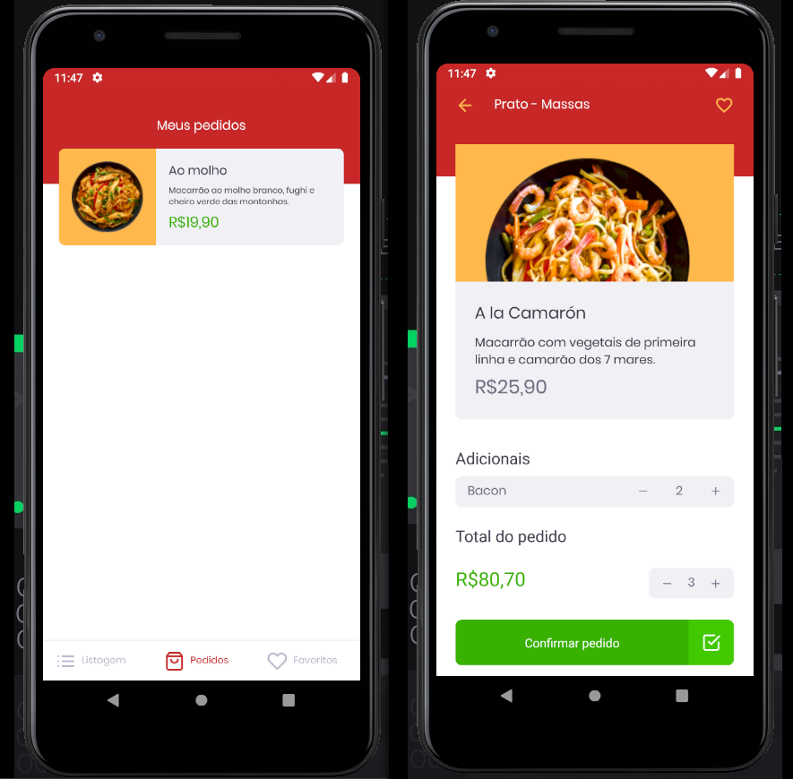

<h1>Resultado Final</h1>

<h1 align="center">
  GoRestaurant
  <br /> <br />
  
  <br /> <br />
  
</h1>

# `Indice`

<a href="#Sobre-o-Desafio">1. Sobre o Desafio</a> <br />
<a href="#Tecnologias-utilizadas">2. Tecnologias utilizadas</a> <br />
<a href="#Como-baixar-o-projeto">3. Como baixar o projeto</a>

## Sobre o Desafio

Essa será uma aplicação que irá se conectar a uma fake API, e exibir os pratos de comida, categoria e permitir a realização de um pedido, podendo visualizar seus pratos favoritos e pedidos.
---

## Tecnologias utilizadas

O projeto foi desenvolvido utilizando as seguintes tecnologias:

- React-Native
- Axios
- TypeScript
- Styled-Components
- History
- Polished
- ReactIcons
- react-navigation/native
- react-native-vector-icons
---
## Como baixar o projeto


```bash

  # Clonar o repositório
  $ git clone https://github.com/DevTeles/GoRestaurant-Mobile.git

  # Entrar no diretório
  $ cd GoRestaurant-Mobile

  # Instalar as dependências
  $ yarn

  # Start na API FAKER
  $ yarn json-server server.json -p 3333

  # Iniciar o projeto
  $ yarn start

  # De acordo com sistema operacional
  $ yarn android
  # ou
  $ yarn ios
```

<br /><br />
Desenvolvido por **Rafael Teles Vital**
